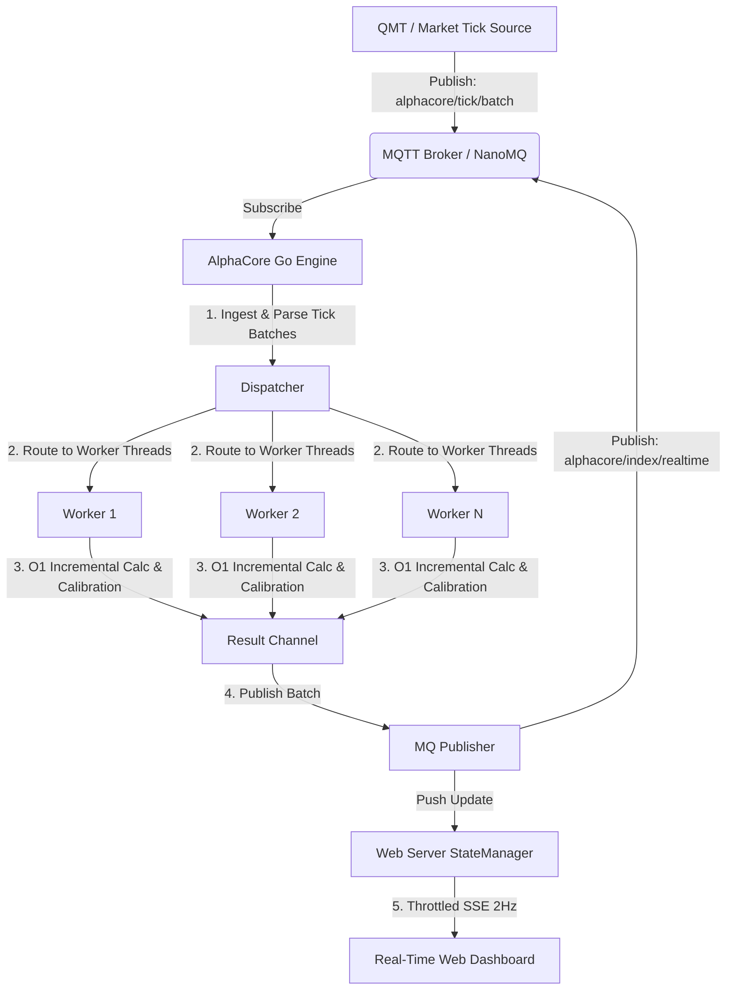
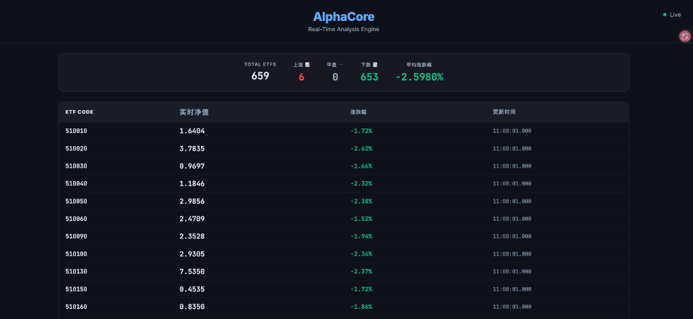

# AlphaCore

AlphaCore is a high-performance, real-time Indicative Optimized Portfolio Value (IOPV) calculation engine for ETFs, written in Go. Designed to handle high-frequency stock tick feeds, it processes market updates and outputs calculated ETF net asset values with sub-millisecond latency. 

The system leverages a lock-free concurrent architecture, incremental calculations, and dynamic CPU-core load balancing to achieve maximum throughput and minimal processing jitter.

---

## System Architecture

The following diagram illustrates the data flow and system architecture:



### Core Optimizations

1. **$O(1)$ Incremental Calculation Model**
   Instead of recalculating the total value of an ETF's components (which can exceed several hundred stocks) on every single tick, AlphaCore uses an incremental delta update scheme. When a stock price changes, the worker computes the price difference (`delta = new_price - old_price`), multiplies it by the stock's shares in the basket, and updates the running total of the affected ETF. This reduces calculation overhead from $O(N)$ to $O(1)$ per tick.

2. **Lock-Free Concurrency**
   Calculation workers run on dedicated goroutines and hold their own thread-local price caches and running totals. There is no shared memory or synchronization locks during the hot path of calculation, completely avoiding thread contention.

3. **Dynamic Workload Load-Balancing**
   At startup, the dispatcher sorts all target ETFs by their component count (descending) and assigns them to worker threads using a greedy load-balancing algorithm. This ensures that the computational load is evenly distributed across available CPU cores.

4. **Throttled SSE Web Dashboard**
   To prevent high-frequency market data from freezing or lagging the front-end browser, the web server maintains a thread-safe state snapshot and pushes updates via Server-Sent Events (SSE) at a throttled rate of 2Hz (every 500ms).

5. **I/O Batching**
   Outgoing calculated IOPVs are buffered and written to the MQTT broker in batches (either every 50ms or when the queue reaches 100 items), minimizing network system call overhead.

---

## Real-Time Web Dashboard

AlphaCore features a built-in dark-themed web dashboard for real-time monitoring of ETF metrics. 



The dashboard displays:
- Overall market status (Total ETFs tracked, count of rising/flat/falling ETFs, average change percentage).
- Real-time estimated IOPV (实时净值), change percentage (涨跌幅), and timestamp for each ETF.

---

## Project Structure

```text
├── assets/                  # Documentation assets (dashboards, diagrams)
├── cmd/
│   └── main.go              # Application entry point
├── config.json              # Service configuration file
├── files/                   # Directory for morning calibration files (user-configured)
├── internal/
│   ├── calibration/         # Pre-market calibration logic
│   ├── config/              # Configuration file parser
│   ├── engine/              # Multi-threaded calculation engine
│   ├── models/              # Struct models for ticks, indices, and results
│   ├── mq/                  # MQTT / NanoMQ client connection and publishing
│   └── web/                 # Web server, state manager, and SSE dashboard
├── go.mod
└── go.sum
```

---

## Data Configuration

### 1. App Configuration (`config.json`)
The application looks for a `config.json` in its working directory to resolve the MQTT broker address and the path to the ETF basket configurations.

```json
{
  "qmt_files_dir": "/path/to/alphacore_config.json",
  "mqtt_broker": "tcp://127.0.0.1:1883"
}
```

### 2. ETF Basket Definition (`alphacore_config.json`)
This file defines the basic tracking parameters and component weights for the target ETFs.

```json
{
  "ETF_CODE": {
    "net_asset_value": 1.00,
    "components": {
      "COMPONENT_STOCK_CODE": 100
    }
  }
}
```

### 3. Pre-Market Calibration
AlphaCore supports optional pre-market calibration. If a calibration file matching the current date is placed in the `./files` directory, the engine loads it at startup to apply scaling coefficients for each ETF code, ensuring that real-time calculations align with exchange baselines.

---

## MQTT Interface

### Input: Market Ticks
- **Topic**: `alphacore/tick/batch`
- **Payload**: JSON array of ticks. Prices are scaled by `1000` internally during calculations.
- **Format**:
```json
[
  {
    "c": "600519",
    "p": 1640.40,
    "v": 2300,
    "a": 3772920.0,
    "t": 1719370801000
  }
]
```

### Output: Estimated IOPVs
- **Topic**: `alphacore/index/realtime`
- **Payload**: JSON array of calculated IOPV results.
- **Format**:
```json
[
  {
    "i": "510050",
    "iopv": 2.9856,
    "r": -0.0238,
    "t": 1719370801000
  }
]
```

---

## Getting Started

### Prerequisites
- **Go**: Version 1.20 or higher.
- **MQTT Broker**: NanoMQ is recommended for ultra-low latency and lightweight deployments, but any standard MQTT broker (like Mosquitto) works.

### Build and Run
1. Start your MQTT broker (e.g., NanoMQ).
2. Configure the `config.json` file in the root directory.
3. Build and launch the engine:
   ```bash
   go build -o alphacore cmd/main.go
   ./alphacore
   ```
4. Access the real-time web dashboard by opening a browser and navigating to `http://localhost:8080` (or `http://<machine-ip>:8080` from your local network).
